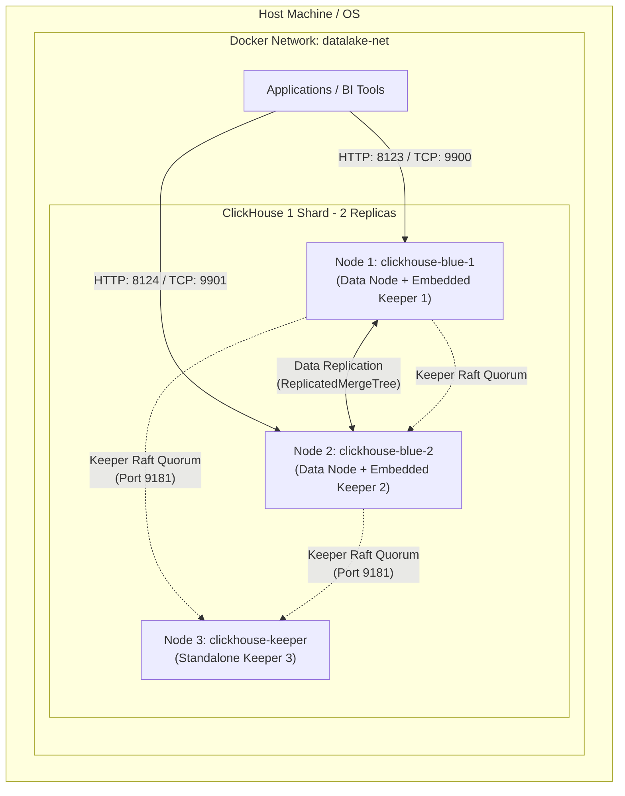
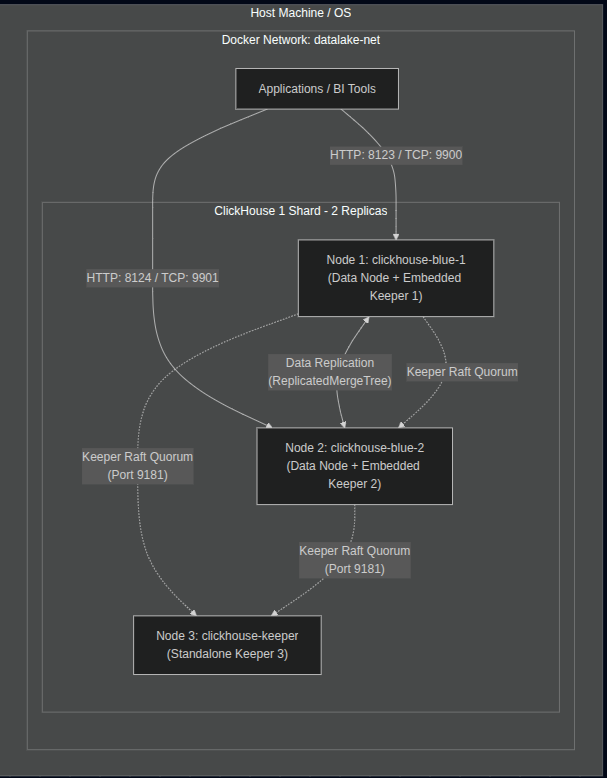

# Tài liệu Triển khai ClickHouse Cluster

## 1. Hệ thống

Hệ thống của bạn là một cụm **ClickHouse Cluster** được thiết kế có tính sẵn sàng cao (High Availability), hướng tới triển khai kiến trúc **1 Shard - 2 Replicas**. 

### 1.1 Chi tiết các thành phần
- **2 Node ClickHouse Server (clickhouse-blue-1, clickhouse-blue-2):**
  - Đóng vai trò vừa là Data node (lưu trữ và xử lý truy vấn) vừa tích hợp ClickHouse Keeper bên trong để tiết kiệm tài nguyên.
  - Cấu hình nhân bản dữ liệu (Replication) giữa hai node (shard=1, replica=r1 & r2).
- **1 Node ClickHouse Keeper độc lập (clickhouse-keeper):**
  - ClickHouse Keeper (thay thế ZooKeeper) dùng để phối hợp các tác vụ phân tán (ReplicatedMergeTree, DDL phân tán).
  - Raft (thuật toán đồng thuận) yêu cầu số lượng node lẻ (ở đây là 3 node: 2 node embedded trong CH và 1 node độc lập). Việc này giúp cụm chịu lỗi (Fault Tolerance) có thể tiếp tục hoạt động nếu 1 trong 3 node Keeper bị chết.
- **Tài nguyên lưu trữ:**
  - Sử dụng Docker Volumes riêng biệt (`ch-blue-1-data`, `ch-blue-2-data`, `ch-keeper-data`) để lưu trữ dữ liệu bền bỉ (persistent).
  - Có mount thư mục `/dict` cho ClickHouse Dictionaries.
- **Mạng (Network):** Mạng `datalake-net` dạng *external*, yêu cầu mạng này phải được tạo từ trước.

### 1.2 Topo Kiến trúc (Topology Diagram)

Dưới đây là sơ đồ topo kiến trúc mô tả luồng giao tiếp giữa các thành phần:




**Giải thích luồng:**
- **App** kết nối tới các node ClickHouse qua các port đã được publish ra localhost (9900/9901 cho Native TCP, 8123/8124 cho HTTP).
- **Data Replication:** 2 node `clickhouse-blue-1` và `clickhouse-blue-2` tự động đồng bộ dữ liệu với nhau cho các table sử dụng Engine `ReplicatedMergeTree`.
- **Raft Quorum:** 3 node Keeper (2 embedded, 1 standalone) giao tiếp với nhau qua port `9181` để bầu chọn Leader và duy trì trạng thái nhất quán của Cluster.

---

## 2. Hướng dẫn Triển khai (Deployment Guide)

**Yêu cầu hệ thống:**
- OS: Linux/macOS
- Đã cài đặt Docker và Docker Compose.
- Đã thiết lập giới hạn ulimits trên host (khuyến nghị cho hệ thống database).

**Bước 1: Tạo mạng Docker External**
Hệ thống sử dụng external network `datalake-net`, bạn cần tạo nó trước khi chạy:
```bash
docker network create datalake-net
```

**Bước 2: Cấu hình biến môi trường (Thông tin xác thực)**
Tạo một file `.env` cùng cấp với thư mục chứa `docker-compose.yml` (hoặc export trực tiếp ở terminal):
```env
CLICKHOUSE_DEFAULT_PASSWORD=your_default_password
CLICKHOUSE_ADMIN_PASSWORD=data123
```

**Bước 3: Khởi động hệ thống**
Chạy lệnh sau tại thư mục chứa file `docker-compose.yml`:
```bash
# Khởi động cụm dười dạng background
docker compose up -d

# Kiểm tra trạng thái các container
docker compose ps
```

**Bước 4: Kiểm tra trạng thái Cluster & Keeper**
Truy cập vào 1 trong các node để kiểm tra xem cluster đã nhận diện đủ node chưa:
```bash
# Kiểm tra cluster
docker exec -it clickhouse-blue-1 clickhouse-client \
  --password data123 -q "SELECT cluster, shard_num, replica_num, host_name FROM system.clusters"

# Kiểm tra trạng thái ClickHouse Keeper
docker exec -it clickhouse-blue-1 bash -c "echo ruok | nc localhost 9181" 
# Output mong đợi: imok
```

---

## 3. Hướng dẫn xây dựng nhà kho
- **Tham khảo** trong tài liệu ví dụ [example](./example.md)

## 4. Hướng dẫn Ứng dụng Kết nối (App Integration Guide)

Ứng dụng có thể kết nối với ClickHouse qua 2 giao thức chính: **Native TCP Protocol** và **HTTP Interface**. 
Mật khẩu mặc định trong biến môi trường theo compose file là `data123` (tùy vào account `default` được map từ `users.d` hoặc account `admin`).

| Node | Native Port (TCP) | HTTP/REST Port |
| :--- | :--- | :--- |
| **Node 1 (clickhouse-blue-1)** | `9900` | `8123` |
| **Node 2 (clickhouse-blue-2)** | `9901` | `8124` |

*Khi ứng dụng ở ngoài Docker truy cập, hãy sử dụng `localhost` hoặc IP của máy chủ kèm theo Port đã map ở trên. Khi ứng dụng nằm cùng mạng `datalake-net` trong Docker, sử dụng hostname: `clickhouse-blue-1:9000`.*

### 4.1. Mã nguồn Backend bằng Python (`clickhouse-connect`)

Sử dụng thư viện chính thức, ưu tiên giao thức HTTP (`clickhouse-connect`).
Cài đặt: `pip install clickhouse-connect`

```python
import clickhouse_connect

# Kết nối đến cụm
try:
    # Kết nối đến Node 1 (hoặc Node 2 qua cổng 8124)
    client = clickhouse_connect.get_client(
        host='localhost', 
        port=8123, 
        username='default', 
        password='data123'
    )

    # Thực hiện Test truy vấn
    result = client.command('SELECT version()')
    print(f"Connected to ClickHouse version: {result}")

    # Truy vấn dữ liệu dạng DataFrame (Ví dụ)
    # df = client.query_df('SELECT * FROM system.numbers LIMIT 5')
    # print(df)

except Exception as e:
    print(f"Lỗi kết nối ClickHouse: {e}")
```

### 4.2. Mã nguồn Backend bằng Java/Spring Boot (JDBC)

Sử dụng thư viện Native JDBC driver của ClickHouse.
Maven Dependency (`pom.xml`):
```xml
<dependency>
    <groupId>com.clickhouse</groupId>
    <artifactId>clickhouse-jdbc</artifactId>
    <version>0.6.0</version> <!-- Thay đổi bản mới nhất -->
</dependency>
```

Code kết nối Java:
```java
import java.sql.Connection;
import java.sql.DriverManager;
import java.sql.ResultSet;
import java.sql.Statement;
import java.util.Properties;

public class ClickHouseApp {
    public static void main(String[] args) {
        // Cấu hình URL kết nối tới Native Port (9900) của Node 1
        String url = "jdbc:ch://localhost:9900/default";
        
        Properties properties = new Properties();
        properties.setProperty("user", "default");
        properties.setProperty("password", "data123");

        try (Connection conn = DriverManager.getConnection(url, properties);
             Statement stmt = conn.createStatement()) {

            // Thực thi câu lệnh
            ResultSet rs = stmt.executeQuery("SELECT version()");
            if (rs.next()) {
                System.out.println("Tiếp cận thành công! Phiên bản ClickHouse: " + rs.getString(1));
            }
        } catch (Exception e) {
            e.printStackTrace();
        }
    }
}
```

### 💡 Khuyến nghị cho Kiến trúc thực tế / Load Balancing:
Vì bạn có 2 Node replicas, trong môi trường Production, ứng dụng nên kết nối thông qua một **Load Balancer (ví dụ HAProxy, Nginx) hoặc kết nối đa host** trên App logic để phân tán tải truy vấn SELECT và đảm bảo HA (Tự động chuyển node khi 1 node sập).
Với Python / JDBC, các tính năng **multi-host** (`host1:9900,host2:9901`) có thể được cung cấp tùy tham số connection string của driver bạn đang sử dụng.